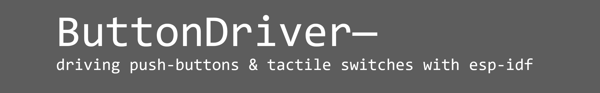

<!-- TABLE OF CONTENTS -->

  
Table of Contents

  <ol>
    <li>
      <a href="#about">about</a>
    </li>
    <li>
      <a href="#getting-started">getting started</a>
      <ul>
        <li><a href="#adding to project">adding to project</a></li>
      </ul>
    </li>
   <li><a href="#usage">usage</a></li>
       <ul>
        <li><a href="#quick start">quick start</a></li>
        <li><a href="#quick example">quick example</a></li>
      </ul>
  <li><a href="#license">license</a></li>
  <li><a href="#contact">contact</a></li>
  </ol>

<!-- ABOUT -->
## About

(<a href="#readme-top">back to top</a>)

## Getting Started

(<a href="#readme-top">back to top</a>)

### Adding to Project

(<a href="#readme-top">back to top</a>)

<!-- USAGE EXAMPLES -->
## Usage

(<a href="#readme-top">back to top</a>)

### Quick Start

(<a href="#readme-top">back to top</a>)

### Quick Example

(<a href="#readme-top">back to top</a>)

<!-- LICENSE -->
## License

(<a href="#readme-top">back to top</a>)

Distributed under the MIT License. See `LICENSE.md` for more information.

(<a href="#readme-top">back to top</a>)

<!-- CONTACT -->
## Contact

(<a href="#readme-top">back to top</a>)

Myles Parfeniuk - myles.parfenyuk@gmail.com

(<a href="#readme-top">back to top</a>)

Project Link: [https://github.com/myles-parfeniuk/button_driver](https://github.com/myles-parfeniuk/button_driver)

(<a href="#readme-top">back to top</a>)

