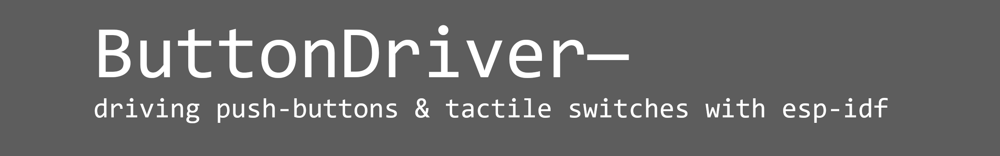
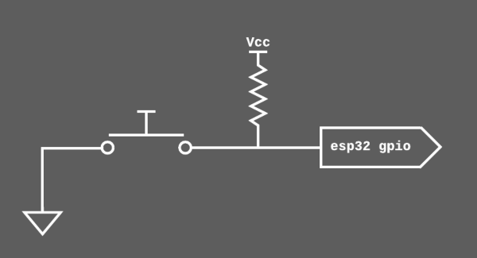
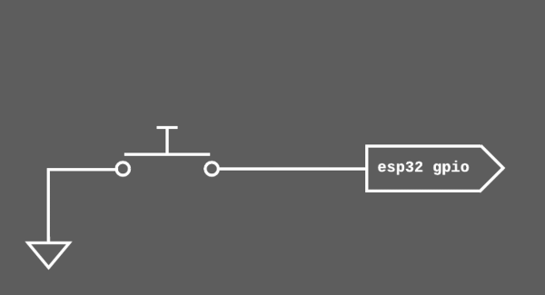
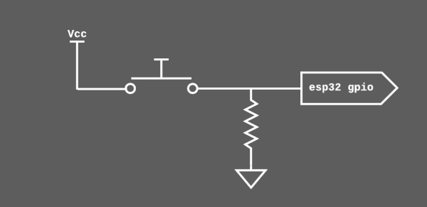
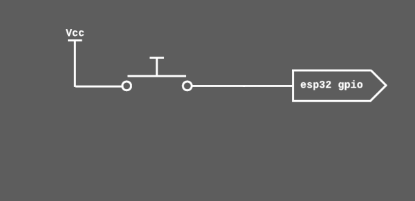
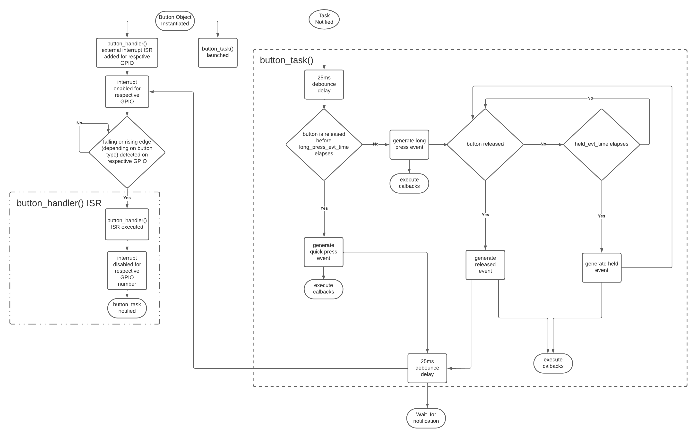

<a name="readme-top"></a>

<!-- TABLE OF CONTENTS -->
<details>
  <summary>Table of Contents</summary>
  <ol>
    <li>
      <a href="#about">About</a>
    </li>
    <li>
      <a href="#getting-started">Getting Started</a>
      <ul>
        <li><a href="#adding-to-project">Adding to Project</a></li>
      </ul>
    </li>
    <li><a href="#usage">Usage</a></li>
    <ul>
      <li><a href="#quick-start">Quick Start</a></li>
      <ul>
        <li><a href="#initializing-button-object">Initializing Button Object</a></li>
        <li><a href="#button-events">Button Events</a></li>
        <li><a href="#handling-button-events">Handling Button Events</a></li>
      </ul>
      <li><a href="#examples">Examples</a></li>
      <li><a href="#program-flowchart">Program Flowchart</a></li>
    </ul>
    <li><a href="#license">License</a></li>
    <li><a href="#contact">Contact</a></li>
  </ol>
</details>


<!-- ABOUT -->
## About

ButtonDriver is a C++ based component written for esp-idf version 5.0+, intended to simplify the use of push-buttons and tactile switches.

It allows for the creation of Button objects which automatically detect user input from externally connected tactile switches or push-buttons.  
Call-back functions can be registered to button objects to handle detected user input.   
<p align="right">(<a href="#readme-top">back to top</a>)</p>

## Getting Started
<p align="right">(<a href="#readme-top">back to top</a>)</p>

### Adding to Project

1. Create a "components" directory in the root workspace directory of your esp-idf project if it does not exist already.

   In workspace directory:     
   ```sh
   mkdir components
   ```


2. Cd into the components directory and clone both the ButtonDriver, and DataControl repos.   

   ```sh
   cd components
   git clone https://github.com/myles-parfeniuk/data_control.git
   git clone https://github.com/myles-parfeniuk/button_driver.git
   ```
   The ButtonDriver is dependent on DataControl and will not build without it.  

<p align="right">(<a href="#readme-top">back to top</a>)</p>

<!-- USAGE EXAMPLES -->
## Usage
<p align="right">(<a href="#readme-top">back to top</a>)</p>

### Quick Start
This is intended to be a quick-guide, api documentation generated with doxygen can be found in the documentation directory of the master branch. 
<p align="right">(<a href="#readme-top">back to top</a>)</p>

#### Initializing Button Object
To initialize a button object, first initialize and configure a button_conf_t struct with the desired settings, then pass it into the Button constructor.  

The settings available within a button_conf_t struct:  
* **gpio_num** — The GPIO number associated with the button, must not be initialized as GPIO_NUM_NC  
* **active_lo** — Set to true if the button is active low (falling edge trigger), cannot be true if active_hi is also true   
* **active_hi** — Set to true if the button is active high (rising edge trigger), cannot be true if active_lo is also true   
* **pull_en** — Set to true if internal pullup/pulldown resistor is enabled for button gpio pin, set to false if external resistors are used  
* **long_press_evt_time** — long-press event generation time in microseconds (us) if the button is held for longer than (long_press_evt_time+25ms) 
                        a long-press event is generated, if it is released before (long_press_evt_time+25ms) elapses, a quick-press event is generated instead
                        suggested time of 300000us, must be between 10000us and 5000000us   
* **held_event_evt_time** — held event generation time in microseconds (us), if a long press event has already occurred and the button is still being held, 
                       held events will be generated every held_evt_time elapses, suggested time of 200000us, must be between 10000us and 5000000us 


If the button_conf_t struct is not initialized correctly the Button constructor will output an error related to the issue in the terminal and dump a stack trace.   

Example Initializations:  

1. Active-Low w/ external pullup  



```cpp
    //initialize button_config_t struct
    Button::button_config_t button_conf =
    {
        .gpio_num = GPIO_NUM_25, //gpio number connected to button, for ex.25
        .active_lo = true, //active low
        .active_hi = false, //not active high
        .pull_en = false, //internal pullup disabled
        .long_press_evt_time = 300000, //300ms long-press event generation time
        .held_evt_time = 200000, //200ms held event generation time
    };

    //declare & initialize Button object
    Button my_button(button_conf);
```

2. Active-Low w/ no external pullup



```cpp
    //initialize button_config_t struct
    Button::button_config_t button_conf =
    {
        .gpio_num = GPIO_NUM_25, //gpio number connected to button, for ex.25
        .active_lo = true, //active low
        .active_hi = false, //not active high
        .pull_en = true, //internal pullup enabled
        .long_press_evt_time = 300000, //300ms long-press event generation time
        .held_evt_time = 200000, //200ms held event generation time
    };

    //declare & initialize Button object
    Button my_button(button_conf);
```

3. Active-High w/ external pulldown



```cpp
    //initialize button_config_t struct
    Button::button_config_t button_conf =
    {
        .gpio_num = GPIO_NUM_25, //gpio number connected to button, for ex.25
        .active_lo = false, //not active low
        .active_hi = true, //active high
        .pull_en = false, //internal pulldown disabled
        .long_press_evt_time = 300000, //300ms long-press event generation time
        .held_evt_time = 200000, //200ms held event generation time
    };

    //declare & initialize Button object
    Button my_button(button_conf);
```

4. Active-High w/ no external pulldown



```cpp
    //initialize button_config_t struct
    Button::button_config_t button_conf =
    {
        .gpio_num = GPIO_NUM_25, //gpio number connected to button, for ex.25
        .active_lo = false, //not active low
        .active_hi = true, //active high
        .pull_en = true, //internal pulldown enabled
        .long_press_evt_time = 300000, //300ms long-press event generation time
        .held_evt_time = 200000, //200ms held event generation time
    };

    //declare & initialize Button object
    Button my_button(button_conf);
```
<p align="right">(<a href="#readme-top">back to top</a>)</p>

#### Button Events
After being initialized, a Button object will automatically detect any user input and generate an event. 

These events come in 4 flavors:

1. **quick-press:**  
   This event indicates the button was momentarily pressed.
   This event is generated when the push-button is pressed & then released before (25ms + long_press_evt_time) has elapsed. 

2. **long-press:**   
   This event indicates the button was pressed and held.
   This event is generated when the push-button is pressed & not released after (25ms + long_press_evt_time) has elapsed. 

3. **held:**   
   This event indicates a long-press event has already occurred, and the button is still being held. 
   This event is generated every time held_evt_time elapses, after a long-press event, until the button is released.

4. **released:**   
   This event indicates the button has been released.
   This event is generated if the button is released any time after a long_press event has occurred. 
<p align="right">(<a href="#readme-top">back to top</a>)</p>

#### Handling Button Events
In order to be notified when a button-event has occurred, a call-back function (or multiple) can be registered with the button by calling the follow() method on its event member.  

As many call-backs as desired can be registered to a button using follow(). When a button event occurs, any call-backs registered to the respective button will be called in the order they were registered— this means whichever call-back was registered first has highest priority.  

It is recommended to initialize the call-back functions as lambda-functions for easy readability.  
Any call-back function registered with follow() must take the form:   
```cpp
  void call_back_example(Button::ButtonEvent event);
```

Example call-back functions & registrations:

1. Using a lambda call-back function:

```cpp
//call the follow() method on a button event member to register a callback with a button
my_button.event.follow(
        //lambda call-back function— called automatically when button input is detected
        [](Button::ButtonEvent event)
        {
            //button event handler
            switch(event){
                case Button::ButtonEvent::quick_press:
                  //place code that should be run on quick-press here
                break;

                case Button::ButtonEvent::long_press:
                  //place code that should be run on long-press here
                break;

                case Button::ButtonEvent::held:
                  //place code that should be run when button is held here
                break;

                case Button::ButtonEvent::released:
                  //place code that should be run when button is released here
                break;
            }
        });
```

2. Using call-back function pointer:

```cpp
//call-back prototype
void my_callback(Button::ButtonEvent event);

//call the follow() method on a button event member to register a callback with a button
my_button.event.follow(my_callback);

//call-back function— called automatically when button input is detected
void my_callback(Button::ButtonEvent event)
{
  
  //button event handler
  switch(event)
  {
    case Button::ButtonEvent::quick_press:
      //place code that should be run on quick-press here
    break;

    case Button::ButtonEvent::long_press:
      //place code that should be run on long-press here
    break;

    case Button::ButtonEvent::held:
      //place code that should be run when button is held here
    break;

    case Button::ButtonEvent::released:
      //place code that should be run when button is released here
    break;
  }
}
```
<p align="right">(<a href="#readme-top">back to top</a>)</p>


### Examples
Examples are available in the ButtonDriver directory of my esp_idf_cpp_examples repo:    
<p align="right">(<a href="#readme-top">back to top</a>)</p>

[https://github.com/myles-parfeniuk/esp_idf_cpp_examples](https://github.com/myles-parfeniuk/esp_idf_cpp_examples)
<p align="right">(<a href="#readme-top">back to top</a>)</p>

### Program Flowchart

<p align="right">(<a href="#readme-top">back to top</a>)</p>

## License
Distributed under the MIT License. See `LICENSE.md` for more information.
<p align="right">(<a href="#readme-top">back to top</a>)</p>

## Contact
Myles Parfeniuk - myles.parfenyuk@gmail.com  
Project Link: [https://github.com/myles-parfeniuk/button_driver](https://github.com/myles-parfeniuk/button_driver)  
<p align="right">(<a href="#readme-top">back to top</a>)</p>
