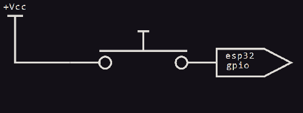

<!-- TABLE OF CONTENTS -->
<details>
  <summary>Table of Contents</summary>
  <ol>
    <li>
      <a href="#About">About</a>
    </li>
    <li>
      <a href="#getting-started">getting started</a>
      <ul>
        <li><a href="#adding to project">adding to project</a></li>
      </ul>
    </li>
   <li><a href="#usage">usage</a></li>
       <ul>
        <li><a href="#quick start">quick start</a></li>
        <ul>
            <li><a href="#Initializing Button Object">Initializing Button Object</a></li>
            <li><a href="#Button Events">Handling Button Events</a></li>
            <li><a href="#Handling Button Events">Handling Button Events</a></li>
        </ul>
        <li><a href="#quick example">quick example</a></li>
      </ul>
  <li><a href="#license">license</a></li>
  <li><a href="#contact">contact</a></li>
  </ol>
</details>


<!-- ABOUT -->
# About

ButtonDriver is a C++ component written for esp-idf version 4.0, intended to simplify the use of push-buttons and tactile switches with the esp-32. 
It allows for the creation of Button objects which automatically detect user input from externally connected tactile switches or push-buttons. 
Call-back functions can be registered with button-objects that execute whenever user input is detected.


# Getting Started


## Adding to Project
1. Create a "components" directory in the root workspace directory of your esp-idf project if it does not exist already.

  In workspace directory:

  ```sh
  mkdir components
  ```


2. Cd into the newly created components directory and clone both the ButtonDriver & DataControl repos. The button_driver component is dependent on the data_control component and will not build without it. 

   ```sh
   cd components
   git clone https://github.com/myles-parfeniuk/data_control.git
   git clone https://github.com/myles-parfeniuk/button_driver.git
   ```


3. You may have to edit project CMakeLists.txt file to include the components.

For example:

  ```shs
  idf_component_register(SRC_DIRS "." 
  INCLUDE_DIRS "" 
  REQUIRES data_control button_driver)
  ```


<!-- USAGE EXAMPLES -->
# Usage

## Quick Start
This is intended to be a quick-guide, full documentation generated with doxygen can be found in the documentation directory.

### Initializing Button Object
To initialize a button object, configure a button_conf_t struct with the desired settings and pass it into the Button constructor.

The settings available within a button_conf_t struct:

* If the button is active low or active high, active_lo must be the opposite of active_hi & vice versa
* Event long press & held event generation times, recommended times of 300000us & 200000us, respectively. Can be adjusted as desired, must be between 10000us & 5000000us 
* GPIO number associated with button, must not be equal to GPIO_NUM_NC (uninitialized)
* If an internal pullup/pulldown should be enabled for the button being initialized (false if external pullups are being used)

If the button_conf_t struct is not initialized correctly the Button constructor will output an error related to the issue in the terminal and dump a stack trace. 

Example Initializations: 

1. Active-Low w/ no internal pullup


```cpp
    //initialize button_config_t struct
    Button::button_config_t button_conf =
    {
        .gpio_num = GPIO_NUM_25, //gpio number connected to button, for ex.25
        .active_lo = true, //active low
        .active_hi = false, //not active high
        .pull_en = false, //internal pullup disabled
        .long_press_evt_time = 300000, //300ms long-press event generation time
        .held_evt_time = 200000, //200ms held event generation time
    };

    //declare & initialize Button object
    Button my_button(button_conf);
```

2. Active-Low w/ internal pullup


```cpp
    //initialize button_config_t struct
    Button::button_config_t button_conf =
    {
        .gpio_num = GPIO_NUM_25, //gpio number connected to button, for ex.25
        .active_lo = true, //active low
        .active_hi = false, //not active high
        .pull_en = true, //internal pullup enabled
        .long_press_evt_time = 300000, //300ms long-press event generation time
        .held_evt_time = 200000, //200ms held event generation time
    };

    //declare & initialize Button object
    Button my_button(button_conf);
```

3. Active-High w/ no internal pullup


```cpp
    //initialize button_config_t struct
    Button::button_config_t button_conf =
    {
        .gpio_num = GPIO_NUM_25, //gpio number connected to button, for ex.25
        .active_lo = false, //not active low
        .active_hi = true, //active high
        .pull_en = false, //internal pulldown disabled
        .long_press_evt_time = 300000, //300ms long-press event generation time
        .held_evt_time = 200000, //200ms held event generation time
    };

    //declare & initialize Button object
    Button my_button(button_conf);
```

4. Active-High w/ internal pullup



```cpp
    //initialize button_config_t struct
    Button::button_config_t button_conf =
    {
        .gpio_num = GPIO_NUM_25, //gpio number connected to button, for ex.25
        .active_lo = false, //not active low
        .active_hi = true, //active high
        .pull_en = true, //internal pulldown enabled
        .long_press_evt_time = 300000, //300ms long-press event generation time
        .held_evt_time = 200000, //200ms held event generation time
    };

    //declare & initialize Button object
    Button my_button(button_conf);
```

### Button Events
After being initialized the Button object will automatically detect any user input and generate an event. 

These events come in four flavors:

1. quick-press: 

This event indicates the switch was momentarily pressed.
This event is generated when the push-button is pressed & then released before (25ms + long_press_evt_time) has elapsed. 

2. long-press: 

This event indicates the switch was pressed and held.
This event is generated when the push-button is pressed & not released after (25ms + long_press_evt_time) has elapsed. 

3. held: 

This event indicates a long-press event has already occurred, and the switch is still being held. 
This event is generated every time held_evt_time elapses, after a long-press event, until the switch is released.

4. released: 

This event indicates the switch has been released.
This event is generated if the switch is released any time after a long_press event has occurred. 

### Handling Button Events
In order to be notified when a button-event has occurred, a call-back function (or multiple) can be registered with the button by calling the follow() method on its event member.

As many call-backs as desired can be added to a button using follow(). When a button event occurs, any call-backs registered to a button with follow() will
be called in the order they were registered with follow() — this means whichever call-back was registered first has highest priority.

It is recommended to initialize the call-back functions as lambda-functions for easy readability.
Any call-back function registered with follow() must take the form: 

```cpp
  void call_back_example(Button::ButtonEvent event);
```

Example call-back functions & registrations:

1. Using a lambda call-back function:

```cpp
//call the follow() method on a button event member to register a callback with a button
my_button.event.follow(
        //lambda call-back function— called automatically when button input is detected
        [](Button::ButtonEvent event)
        {
            switch(event){
                case Button::ButtonEvent::quick_press:
                  //place code that should be run on quick-press here
                break;

                case Button::ButtonEvent::long_press:
                  //place code that should be run on long-press here
                break;

                case Button::ButtonEvent::held:
                  //place code that should be run when button is held here
                break;

                case Button::ButtonEvent::released:
                  //place code that should be run when button is released here
                break;
            }
        });
```

2. Using call-back function pointer:

```cpp
//call-back prototype
void my_callback(Button::ButtonEvent event);

//call the follow() method on a button event member to register a callback with a button
my_button.event.follow(my_callback);

//call-back definition 
void my_callback(Button::ButtonEvent event)
{
  //call-back function— called automatically when button input is detected
  switch(event)
  {
    case Button::ButtonEvent::quick_press:
      //place code that should be run on quick-press here
    break;

    case Button::ButtonEvent::long_press:
      //place code that should be run on long-press here
    break;

    case Button::ButtonEvent::held:
      //place code that should be run when button is held here
    break;

    case Button::ButtonEvent::released:
      //place code that should be run when button is released here
    break;
  }
}
```


## Quick Example


<!-- LICENSE -->
# License
Distributed under the MIT License. See `LICENSE.md` for more information.

<!-- CONTACT -->
# Contact
Myles Parfeniuk - myles.parfenyuk@gmail.com
Project Link: [https://github.com/myles-parfeniuk/button_driver](https://github.com/myles-parfeniuk/button_driver)

